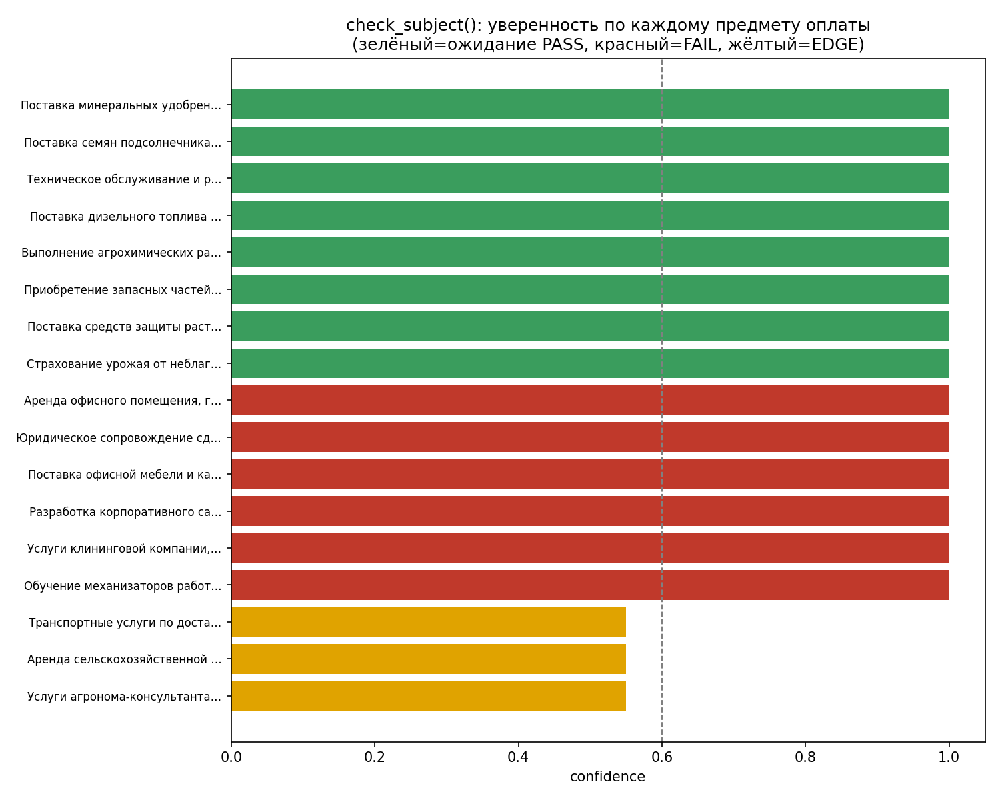

# test_ds_credit - модуль интеллектуальной обработки документов

Тестовое задание Data Science: модуль для автоматизации проверки документов,
подтверждающих целевое использование льготных сельхоз-кредитов.

Реализованы три независимые функции:

| Функция | Файл | Назначение |
|---|---|---|
| `extract(text) -> dict` | `app/extract.py` | извлечение суммы, даты, ИНН, контрагента, предмета оплаты |
| `classify(text) -> (str, float)` | `app/classify.py` | классификация типа документа (contract/spec/invoice/act/unknown) |
| `check_subject(subject) -> (bool, float, str)` | `app/subject_check.py` | проверка соответствия предмета оплаты льготной программе |

## 1. Как запустить проект

Требуется Python 3.11+.

```bash
python -m pip install -r requirements.txt
python -m pytest
python scripts/run_report.py
```

Три команды: установка зависимостей → тесты → отчёт по датасету (таблицы
в консоль + график `reports/confidence_chart.png`).

Быстрая проверка без установки зависимостей (только стандартная библиотека,
без pytest/matplotlib):

```bash
python -c "from app import extract; print(extract('Сумма: 1 250 000,00 руб.'))"
```

## 2. Технологии и почему

- **Чистый Python + `re` + `difflib`** - вся логика (regex-парсинг полей,
  keyword-скоринг классификатора, fuzzy-сравнение категорий) реализована
  без внешних ML/NLP-библиотек и без вызовов LLM API. На выборке из 6–17
  документов обучать модель нецелесообразно, а прозрачное
  правило-ориентированное решение легче объяснить, протестировать и
  доверять его выводам в финансовом сценарии (казначейству нужно понимать
  *почему* агент принял то или иное решение).
- **`pytest`** - тесты, включая обязательные assert'ы из задания и прогон
  по всему датасету.
- **`matplotlib`** - единственная "тяжёлая" зависимость, нужна только для
  графика уверенности `check_subject()` в отчёте; сам пайплайн от неё не
  зависит.
- LLM/LangChain **не подключены** намеренно (см. `app/subject_check.py`,
  docstring и раздел «Возможные улучшения» в `RESULTS.md`) - вариант 1 из
  задания (без внешних API) выбран как основной, чтобы код гарантированно
  запускался локально без ключей. Место для LLM-варианта с fallback
  архитектурно предусмотрено (см. ниже).

## 3. Архитектура решения

```
test_ds_credit/
├── app/
│   ├── extract.py        # извлечение полей (amount/date/inn/contractor/subject)
│   ├── classify.py       # классификация типа документа
│   ├── subject_check.py  # проверка целевого назначения платежа
│   └── numwords_ru.py    # разбор сумм, записанных русскими словами
├── dataset/               # тестовые документы (выданы вместе с заданием)
├── tests/                 # pytest-тесты (unit + прогон по датасету)
├── scripts/
│   └── run_report.py     # прогон пайплайна по датасету + таблицы + график
├── reports/               # сюда сохраняется confidence_chart.png
├── requirements.txt
├── pytest.ini
├── RESULTS.md
└── README.md
```

**Логика `extract()`** (пример пайплайна для одного документа):

1. Убрать служебные аннотации вида `(не 01.03.2025!)` - такие пометки
   встречаются в тестовом OCR-документе как подсказка для проверяющего и
   не должны попадать в реальный OCR-текст (см. `RESULTS.md`).
2. `extract_amount` - искать сумму рядом с ключевыми словами
   («итого», «всего», «составляет», «к оплате»); если рядом с ключевым
   словом стоит не число, а сумма прописью - распознать её через
   `numwords_ru.find_amount_in_words`; если ключевых слов нет вообще -
   взять максимальную найденную в тексте сумму (эвристика "итог обычно
   самое большое число в документе").
3. `extract_date` - собрать все даты трёх поддерживаемых форматов
   (`01.03.2025`, `1 марта 2025 г.`, `03/01/25`) и взять самую раннюю по
   положению в тексте (в большинстве документов первая дата - это дата
   составления документа).
4. `extract_inn` / `extract_contractor` - найти все ИНН и названия
   компаний, определить, какие из них относятся к стороне
   Поставщик/Продавец/Исполнитель (а не Покупатель/Заказчик), по
   близости к соответствующей метке в тексте.
5. `extract_subject` - по убыванию приоритета: явная метка «Предмет
   оплаты:»/«Предмет:», первая строка таблицы товаров, пункт 1.1
   договора, поле «Основание:».

**Логика `classify()`**: скоринг по взвешенным regex-паттернам,
характерным для каждого типа документа (заголовки вида «Счёт на оплату»,
«Спецификация», «УПД» получают наибольший вес, т.к. однозначно указывают
на тип; общие слова вроде «договор» - минимальный вес, поскольку часто
встречаются как ссылка в документах другого типа). Итоговая уверенность -
доля скора победителя от суммы скоров всех категорий; если разрыв между
1-м и 2-м местом меньше порога `CONFIDENCE_GAP_THRESHOLD = 0.15` -
результат считается ненадёжным и возвращается `unknown`.

**Логика `check_subject()`**: словарь разрешённых категорий (агрохимия,
семена, техника, топливо, полевые работы, страхование урожая) + словарь
явно исключённых категорий, сравнение через точное вхождение подстроки и,
как fallback, нечёткое сравнение (`difflib.SequenceMatcher`) для описаний,
не встречавшихся в списке дословно. Отдельно обрабатываются "пограничные"
формулировки - когда разрешённое слово встречается рядом с маркером
услуги/аренды/консультации (например, "аренда сельхозтехники",
"транспортные услуги по доставке удобрений") - такие случаи получают
`matches=False` с уверенностью строго ниже 0.6, сигнализируя, что нужна
ручная проверка, а не автоматический отказ или одобрение.

## 4. Компромиссы и упрощения

- **Regex вместо NER/ML** для извлечения полей - оправдано объёмом
  датасета (6 документов + 1 OCR) и тем, что документы структурированы
  (типовые шаблоны договоров/счетов/актов). На проде с реальным
  разнообразием форматов потребовалась бы более устойчивая модель
  (например, LayoutLM/донастроенный NER или LLM-экстрактор с
  function calling), но для тестового задания это было бы избыточно и
  менее прозрачно.
- **Одно поле `date`** вместо отдельных `issue_date`/`due_date` - сделано
  по заданной сигнатуре функции, но на реальном датасете (`invoice_002.txt`)
  это создаёт неоднозначность.
- **`check_subject()` реализован без LLM** (вариант 1 из задания) -
  осознанный выбор ради воспроизводимости без ключей API; архитектурно
  функция может быть заменена на LLM-версию с сохранением того же
  контракта `(bool, float, str)`, с текущей реализацией как fallback.
- **Классификатор на ключевых словах, а не ML-классификатор** - при 6
  документах обучающая выборка физически недостаточна для честного ML;
  keyword-скоринг с порогом на "unknown" - сознательно выбранный
  компромисс между простотой и надёжностью (лучше явный "не знаю", чем
  уверенная ошибка).
- **Извлечение `subject`** (предмет оплаты, поле в `extract()`) - самое
  слабое место пайплайна: это открытая NLP-задача (выделение сути из
  свободного текста), эвристики покрывают только явные текстовые метки и
  типовые структуры договоров/таблиц. Поле не участвует в обязательных
  assert'ах задания и не покрыто README-датасета ожидаемыми значениями -
  честно помечено как best-effort.

## 5. Как проверить работу сервиса

```bash
python -m pytest -v                    # 44 теста: unit-тесты + прогон по всему датасету
python scripts/run_report.py # таблицы extract/classify/check_subject + график
```

`scripts/run_report.py` сверяет `extract()` и `classify()` с ожидаемыми
значениями из `dataset/README.md` и печатает построчную сверку с пометками
`OK`/`DIFF`, а также итоговый % совпадений по `check_subject()` на
`dataset/subjects_test.txt`.

## 6. Примеры вызовов

```python
from app import extract, classify, check_subject

extract("Итого к оплате: 1 250 000,00 руб. ... ИНН 7701234567 ...")
# {'amount': 1250000.0, 'date': '2025-03-24', 'inn': '7701234567',
#  'contractor': 'ООО «ТехАгро»', 'subject': 'Карбамид марки Б'}

classify("Счёт на оплату №12 от 01.03.2025 ...")
# ('invoice', 1.0)

check_subject("Аренда сельскохозяйственной техники на период уборки урожая")
# (False, 0.55, "содержит признаки категории «техника: обслуживание / ремонт /
#  запчасти», но описывает услугу/аренду, а не прямую поставку товара или
#  выполнение сельхоз-работ - требуется ручная проверка")
```

График уверенности `check_subject()` по всем 17 предметам из
`dataset/subjects_test.txt` (генерируется скриптом `scripts/run_report.py`
в `reports/confidence_chart.png`):


